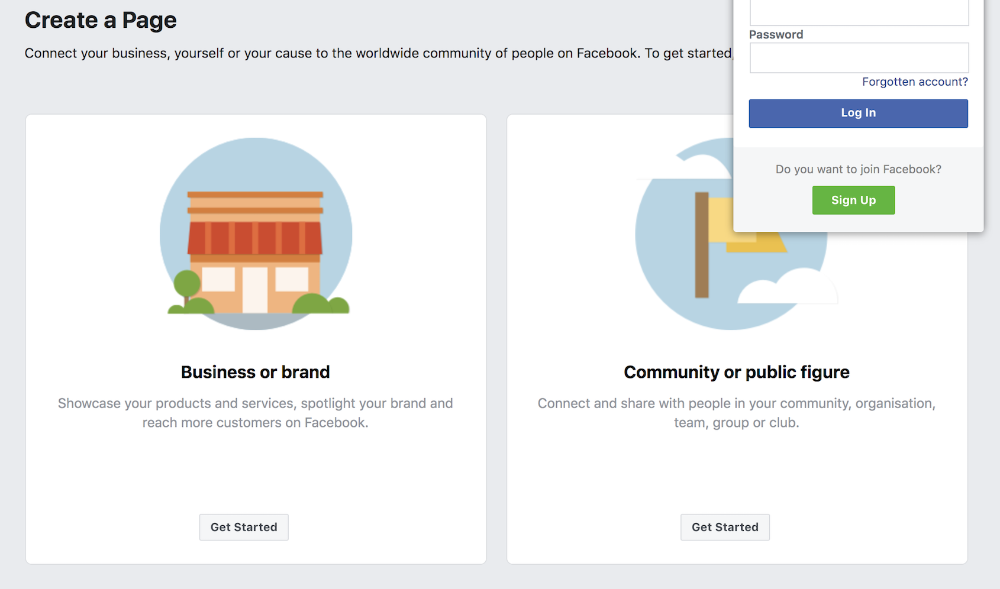

# Birthday Countdown Bot

This is a Facebook Messanger chatbot created with NodeJS, Express and MongoDB. 

Functionality: The bot calculates the number of days to a given user's birthday.

## Installation

1) clone this project by using the command:

`git clone https://github.com/Jo-IE/birthday-chatbot`

2) run npm install to install the dependencies.

3) Facebook requires a secure connection to run the bot. Go to https://ngrok.com/download and follow the instructions for creating an http tunnel for free. Make sure to create a new terminal to run ngrok.

4) Go to https://www.facebook.com/pages/creation/ to create a public facebook page.

5) Once the page is set up, create an application for your bot [here](https://developers.facebook.com/quickstarts). You can name your app anything.

6) After the app is set up you will be directed to the app dashboard. Scroll down the **Add a Product** section to find the **Messenger** option then click the **Set Up** button. This will redirect you to the Messenger Platform.

7) Once there, locate the “Token Generation” section and connect your app to a Facebook Page. This will generate a Page Access token that you should save to your .env file as `PAGE_ACCESS_TOKEN`.

8) Go to the **Webhooks** section and click on **Setup Webhooks**. The **Callback URL** is the https version of the ngrok url you generated in step (3). The **Verify Token** is 'birthday-bot'. Under **Subscription fields**, select *messaging* and *messaging_postbacks*.

9) Click on **Verify and Save** and hit **Subscribe** to subscribe your webhook to events on your page. 

10) Create a MongoDB database and save your URI in a .env file as `MONGO_URI`.

11) Run your app and go to your facebook page to start messaging the bot.

